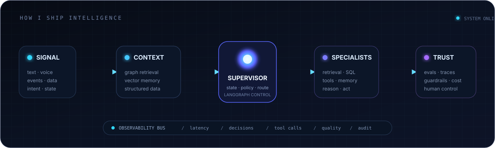

<p align="center">
  
</p>

<h1 align="center">MELVIN // AI SYSTEMS ENGINEER</h1>

<p align="center">
  <strong>Agentic AI &nbsp;·&nbsp; Retrieval &nbsp;·&nbsp; Multi-Agent Orchestration &nbsp;·&nbsp; LLM Infrastructure</strong>
</p>

<p align="center">
  
</p>

<p align="center">
  <a href="https://melvin-shajan-portfolio.vercel.app"></a>
  <a href="https://www.linkedin.com/in/melvin-shajan"></a>
</p>

<br />

> I build AI systems that can **retrieve the right context, coordinate specialist agents, use tools safely, and explain what happened afterward.**

I am an **AI Engineer and Software Developer at NCompass TechStudio**, working across orchestration, retrieval, knowledge graphs, production APIs, and observability. My favorite problems live where an impressive model demo has to become a dependable software system.

---

## `01 // SYSTEM MAP`

<p align="center">
  
</p>

---

## `02 // LIVE MODULES`

<table>
  <tr>
    <td width="50%" valign="top">
      <sub>CONTROL PLANE / 01</sub>
      <h3>Multi-Agent Control Platform</h3>
      <p>A supervisor routes natural-language requests through schema discovery, guarded SQL generation, validation, execution, and a complete agent trace.</p>
      <p><code>NestJS</code> <code>LangChain</code> <code>PostgreSQL</code> <code>React</code></p>
      <p><a href="https://github.com/Melvin-M-Shajan/multi-agent-control-platform"><strong>Source →</strong></a> &nbsp; <a href="https://multi-agent-control-platform-demo.vercel.app/"><strong>Demo ↗</strong></a> &nbsp; <a href="https://www.npmjs.com/package/melcp"><strong>npm ↗</strong></a></p>
    </td>
    <td width="50%" valign="top">
      <sub>WORK INTELLIGENCE / 02</sub>
      <h3>Cortex</h3>
      <p>Turns fragmented text, voice, and screenshots into prioritized actions, searchable semantic memory, and inspectable agent decisions.</p>
      <p><code>FastAPI</code> <code>LangGraph</code> <code>pgvector</code> <code>Redis</code> <code>Next.js</code></p>
      <p><a href="https://github.com/Melvin-M-Shajan/Cortex"><strong>Source →</strong></a> &nbsp; <a href="https://cortex-ai-memory.vercel.app/demo"><strong>Demo ↗</strong></a></p>
    </td>
  </tr>
  <tr>
    <td width="50%" valign="top">
      <sub>CONNECTED MEMORY / 03</sub>
      <h3>Logseqo</h3>
      <p>A real-time block editor where pages, references, backlinks, and collaborative events become a living Neo4j knowledge graph.</p>
      <p><code>React</code> <code>NestJS</code> <code>Neo4j</code> <code>TipTap</code> <code>Socket.IO</code></p>
      <p><a href="https://github.com/Melvin-M-Shajan/Logseq-II"><strong>Source →</strong></a> &nbsp; <a href="https://logseqo-knowledge-graph.vercel.app/"><strong>Demo ↗</strong></a></p>
    </td>
    <td width="50%" valign="top">
      <sub>PERSONAL INTERFACE / 04</sub>
      <h3>Portfolio</h3>
      <p>An accessible, motion-rich engineering portfolio with project case studies, local MDX content, and a grounded server-side assistant.</p>
      <p><code>Next.js</code> <code>TypeScript</code> <code>Motion</code> <code>GSAP</code></p>
      <p><a href="https://github.com/Melvin-M-Shajan/Portfolio"><strong>Source →</strong></a> &nbsp; <a href="https://melvin-shajan-portfolio.vercel.app"><strong>Visit ↗</strong></a></p>
    </td>
  </tr>
</table>

---

## `03 // PRODUCTION SIGNAL`

<table>
  <tr>
    <td width="33%" align="center">
      <h2>10+</h2>
      <strong>production APIs</strong><br />
      <sub>designed and shipped</sub>
    </td>
    <td width="33%" align="center">
      <h2>−30%</h2>
      <strong>processing time</strong><br />
      <sub>through onboarding automation</sub>
    </td>
    <td width="33%" align="center">
      <h2>96 GB</h2>
      <strong>pipeline workload</strong><br />
      <sub>processed with Apache NiFi</sub>
    </td>
  </tr>
</table>

---

## `04 // TOOLCHAIN`

<p align="center">
  
</p>

<p align="center">
  
  
  
  
  
</p>

---

## `05 // CURRENT TRANSMISSION`

```text
FOCUS       evaluation-driven retrieval + graph-based memory
BUILDING    observable agent workflows + safe tool execution
OPTIMIZING  the path from prototype → reliable production system
LOCATION    Coimbatore, Tamil Nadu, India
STATUS      shipping at NCompass TechStudio
```

<p align="center">
  <strong>Have an interesting AI systems problem?</strong><br />
  <sub>Bring the messy architecture diagram. I like those.</sub>
</p>

<p align="center">
  <a href="https://melvin-shajan-portfolio.vercel.app"><strong>Portfolio</strong></a>
  &nbsp; // &nbsp;
  <a href="https://www.linkedin.com/in/melvin-shajan"><strong>LinkedIn</strong></a>
  &nbsp; // &nbsp;
  <a href="https://github.com/Melvin-M-Shajan?tab=repositories"><strong>Repositories</strong></a>
</p>
