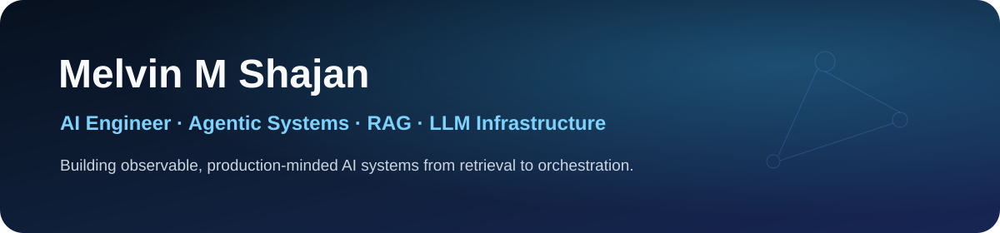

  

I am an AI Engineer and Software Developer at **NCompass TechStudio**, focused on agentic AI, retrieval systems, multi-agent orchestration, and the infrastructure that makes LLM applications observable and reliable.

My production work includes **10+ APIs**, an onboarding workflow that reduced processing time by **30%**, and an Apache NiFi pipeline processing datasets up to **96 GB**.

## What I build

- Agent supervisors, tool-use workflows, and stateful orchestration with LangGraph and LangChain.
- RAG and knowledge-graph retrieval with Neo4j, vector search, PostgreSQL, and evaluation loops.
- Production AI backends with Python, FastAPI, NestJS, queues, observability, and Docker.
- Clear frontend demonstrations that make complex systems easy to inspect.

## Featured engineering work

| Project | Engineering focus | Stack |
| --- | --- | --- |
| [**Multi-Agent Control Platform**](https://github.com/Melvin-M-Shajan/multi-agent-control-platform) · [Demo](https://multi-agent-control-platform-demo.vercel.app/) | Local-first PostgreSQL introspection, safe natural-language-to-SQL, supervisor routing, and complete agent traces. Published as [`melcp`](https://www.npmjs.com/package/melcp). | NestJS · LangChain · PostgreSQL · React |
| [**Cortex**](https://github.com/Melvin-M-Shajan/Cortex) · [Demo](https://cortex-ai-memory.vercel.app/) | Asynchronous work memory that converts text, voice, and screenshots into prioritized tasks and semantic memory. | FastAPI · LangGraph · pgvector · Redis · Next.js |
| [**Portfolio**](https://github.com/Melvin-M-Shajan/Portfolio) | Static, accessible AI Engineer portfolio with project case studies, local MDX, and a server-side grounded assistant. | Next.js · TypeScript · Motion · GSAP |
| [**Logseqo**](https://github.com/Melvin-M-Shajan/Logseq-II) · [Demo](https://logseqo-knowledge-graph.vercel.app/) | Real-time block editor backed by a Neo4j knowledge graph, references, backlinks, and collaborative events. | React · NestJS · Neo4j · TipTap · Socket.IO |

## Core stack

## Current focus

I am strengthening evaluation-driven retrieval, graph-based memory, agent observability, and safe deployment patterns for production LLM systems.

  <a href="https://melvin-shajan-portfolio.vercel.app"><strong>Portfolio</strong></a>
  &nbsp;·&nbsp;
  <a href="https://www.linkedin.com/in/melvin-shajan"><strong>LinkedIn</strong></a>

